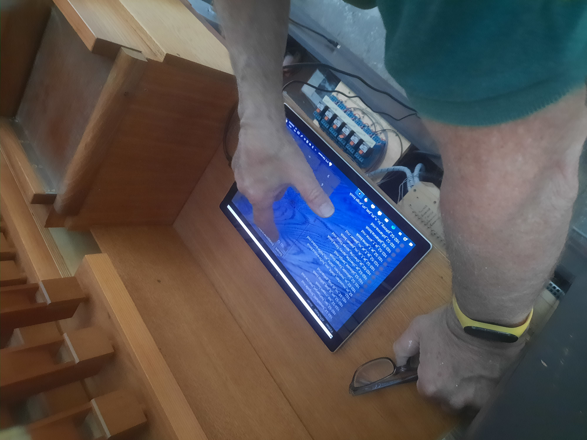
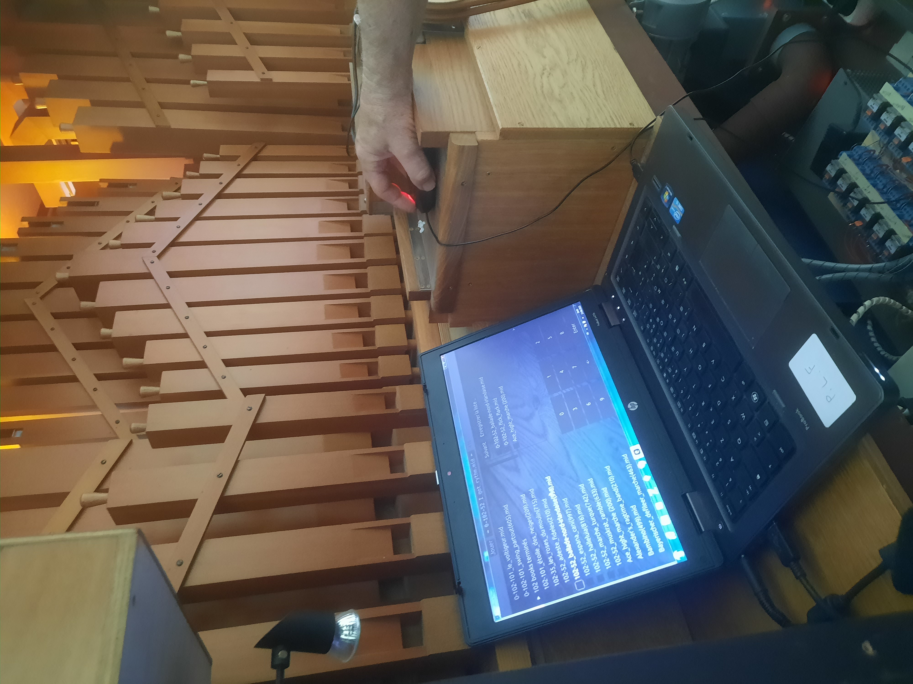
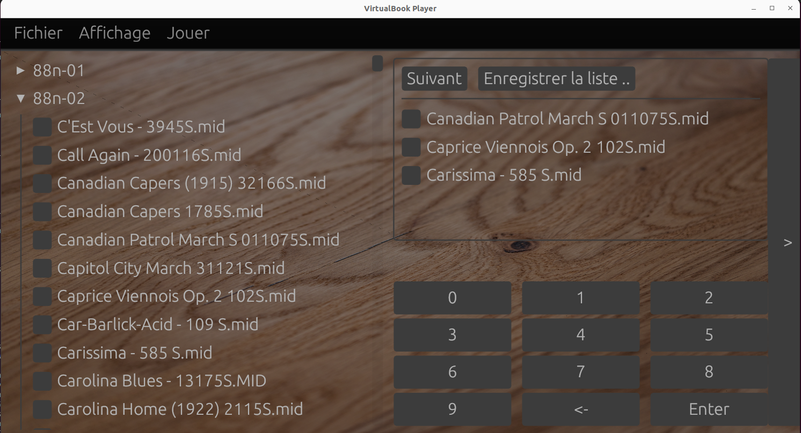
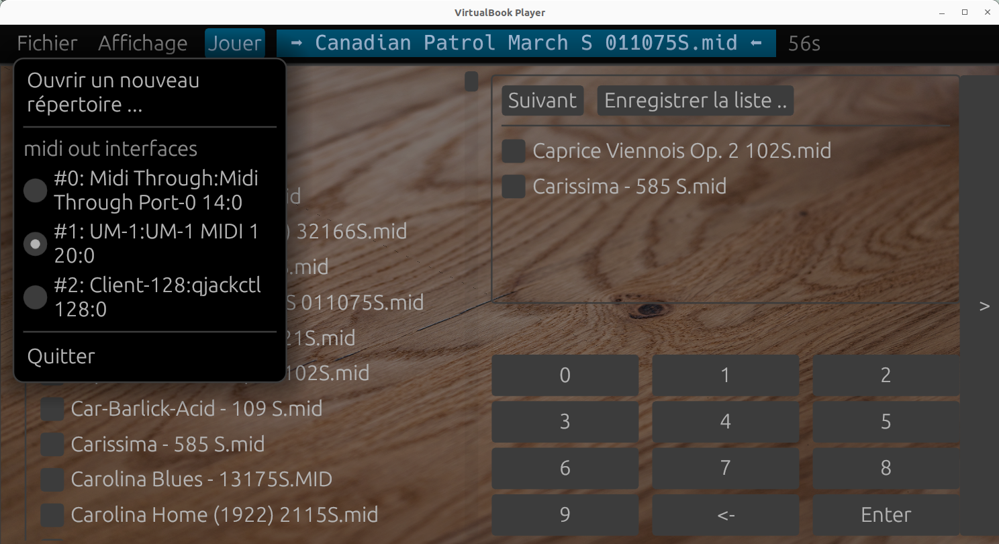

# Midi and Virtual Book jukebox Player

A cross-platform MIDI and virtual book jukebox player. It only includes the necessary functionalities to play MIDIfied instruments, such as Yamaha pianos and barrel/fair/dance organs. This program transforms a standard x64 touch PC tablet into a playback screen device.


## Features:

- Play MIDI files only (for now).
- View the playback in piano roll format.
- Large and clear tree view for files.
- Load prepopulated playlists (text files containing lists of files).
- Add files to the current playlist using a number and the enter key.
- Remove a file from the playlist by clicking on it.
- Skip the current playing file for exploration.
- Send panic or note-off messages to all channels when starting/stopping playback.
- Adjust zoom factor for touch and reading from a distance.

## Download and install

The software is available for linux, windows [https://github.com/barrelorgandiscovery/virtualbookplayer/releases](https://github.com/barrelorgandiscovery/virtualbookplayer/releases). 




## Other setup :



## Screen shots :

Fileview, and playlist construction :
 

Piano Roll display :
 

Midi output selection : (don't need to restart the application, plug and choose the output port)
 


## launch using command line

several options are available thought command line, 

```
    virtualbookplayer --help
```

this returns : 

```
Usage: virtualbookplayerapp [OPTIONS]

Options:
  -r, --reset-preferences      Name of the person to greet
  -l, --lang-code <LANG_CODE>  
  -h, --help                   Print help
  -V, --version                Print version

```

### option -r, --reset-preferences  

this option reset the saved preferences (window size, output midi port, ... )

### option  -l, --lang-code <LANG_CODE>  

Overload the window language, and take this value instead of trying to detect it

There are two languages available : french and english, the software try to detect it from the LANG environement variable.
if not detected english is taken

 codes are two char ISO country code in lower case