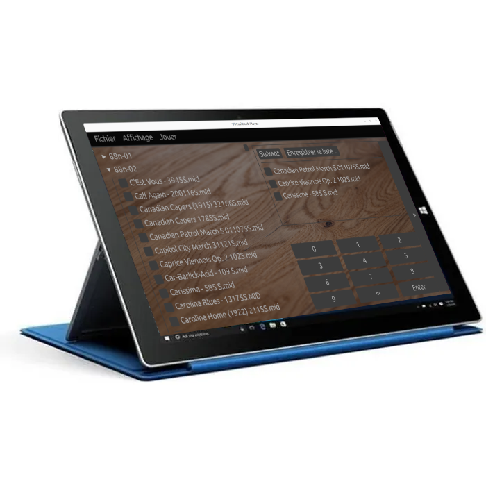

# Midi and Virtual Book jukebox Player

A Cross plateform midi and virtual book, jukebox player. __Only the needed functionnalities to play MIDIfied instruments__. As Yamaha piano, barrel / fair / dance organs

Key features :
- Play Midi file only (for the moment)
- Send panic, or notes off on all channels, when starting / stoping playing
- Add files to current playlist using a number + enter key
- revoke a file in the list
- skip current play file
- View the play (piano roll)
- Large treeview of the music folder files
- Adjust zoom factor for touch and far away reading

Typical setup :

Other setup :

Screen shots :

Fileview, and playlist construction :
 

Piano Roll display :
 

Midi output selection : (don't need to restart the application, plug and choose the output port)
 

